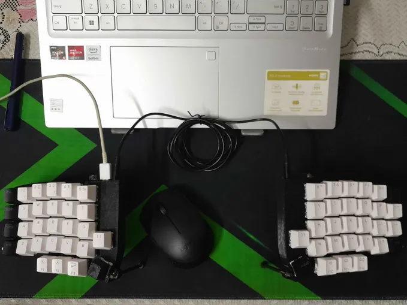

# Handwired Lily58 Build Guide

 
This build was pretty cheap and costed me around 3k rupees or about 40$

### Prerequisite
For building this keyboard, you need the following tools and parts, and you should also know how to solder

##### Tools:
- Soldering Iron
- Access to a 3d printer (otherwise you can order 3d printed parts)

##### Parts:
- 2 Arduino Pro Micros (you can use other micro controllers but then you'd have to edit the design files)
- Single core wires
- 1 USB C breakout board
- 58 diodes (I recommend buying extras)
- 58 mechanical switches 
- keycap (obv)

##### Optional Parts:
- 8 M4X8mm Threaded inserts 
- 8 M4 Screws
- 12 WS2812B RGB
- Acrylic Sheet and Access to a laser cutter

#### 1. Case
Fusion Files and stls are Available in [design files](./design%20files)

#### 2. Software
Keymaps and config files are located in [Keymaps](./simplycode07)
